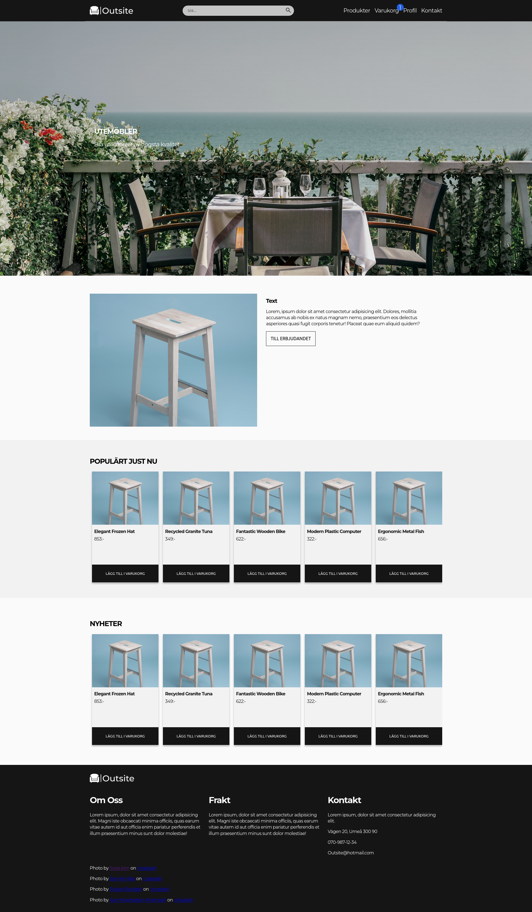
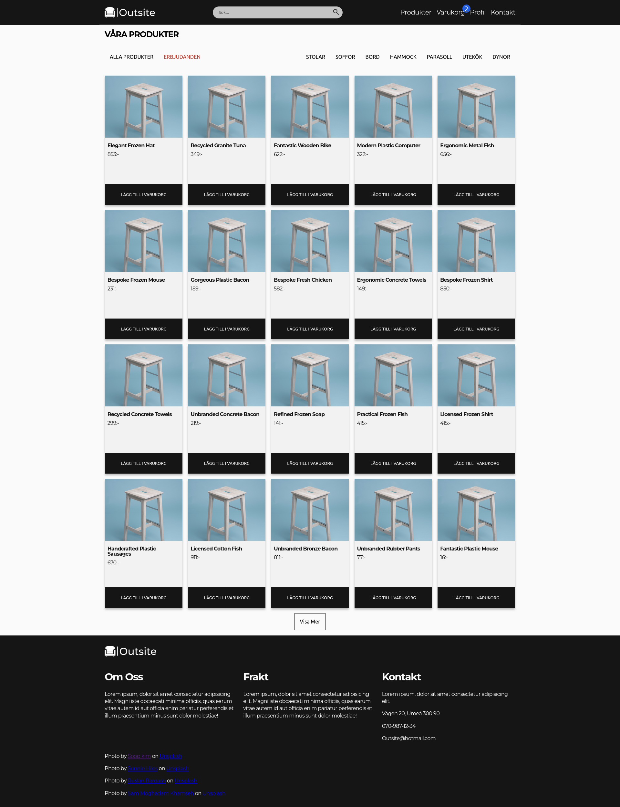
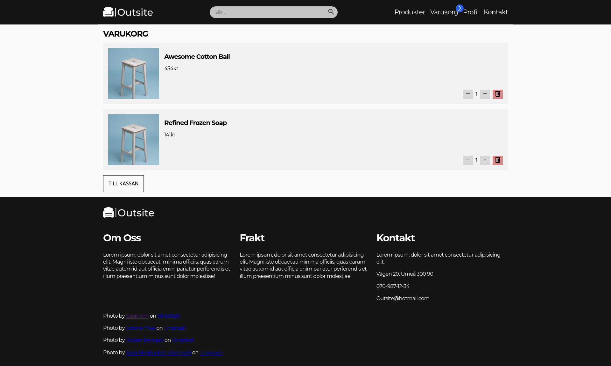

# Vad var uppdraget?

Uppgiften var att först skapa en webbshop frontend som följde ett förbestämt tema. Temat jag blev tilldelad var utemöbler och skulle då skapa en frontend som var anpassad till just det. 
Frontenden skulle innehålla en del saker, bland annat produkter, en varukorg och ett sökfält.
Sedan skulle vi jobba på att skapa en lokal backend som hemsidan kunde hämta från. Detta gjordes med prisma och express i ett separat repository. Backenden skulle kunna leverera produkter, dessa produkter skulle även ha kategorier. Slutligen efter det skulle vi ansluta samman våran frontend och backend med en react sida som anroppade backenden då den behövde produkter bland annat.

# Hur löste vi/jag det?

Den första frontenden gjorde jag i 11ty eftersom att jag tycker det är smidigt verktyg när det kommer till att skapa hemsidor. Däremot var jag tvungen att göra om sidan i react då 11ty är gjord för statiska hemsidor och react var mer passande för situationen. 

Utvecklandet av backenden gick lite mer skakigt jämfört med frontenden. I början var det lite svårt att förstå hur Prisma fungerade, bland annat var det svårt att förstå hur vi skulle ansluta modelerna med `relations`. Tillslut fick vi till det i gruppen och använde en `many-to-many` anslutning mellan produkter och kategorier så att en produkt kan ha flera kategorier och en kategori kan finnas på flera produkter.

Att leverera och ta emot datan gick bra, vi använde Express för att skapa de olika routes som behövdes för att hämta viss data. 

Jag la även till möjligheten att logga in på hemsidan via Google. För att göra detta använde jag mig av både `Google Oauth` och `Axios`. Jag märkte att jag inte kunde verifiera användarens inloggnings token ifall jag endast använde Javascripts inbyggda `fetch` funktion och använde därför istället Axios. Jag hann inte lägga till några funktioner till efter att man loggat in men tanken var att man skulle kunna lämna recenssioner på produkter. Inloggningen skulle även sparas som en `cookie`.

Jag använde mig även av context i React både för att hantera varukorgen så som vi blev visade men även för att hantera Google inloggningen. 

# Vad gick bra/vad lärde jag mig?

Jag tyckte själva designandet av frontenden gick ganska bra för mig. Jag stötte på vissa problem med exempelvis navbaren då jag ville ha den genomskinlig men lyckades lösa dem eventuellt, i navbarens fall var jag tvungen att använda mig av `position: fixed;` istället för `position: sticky;` då sticky fortfarande tar upp plats på sidan och pressar därför ner elementen nedan. Fixed gjorde inte det utan fungerar som `position: absolute;` vilket gjorde att den kunde överlappa bakgrunden.

Att ansluta frontenden och backenden genom att kalla på information gick även väldigt bra, jag stötte inte på några stora problem gällande det. 

Att skapa själva Express routesen tyckte jag även fungerade ganska bra. 

Jag lärde mig hur man använde sig av Google Oauth för att hantera login på hemsidan. Det gick väldigt bra och jag stötte inte på många problem annat än att jag var tvungen att använda Axios istället för fetch. 

# Mindre bra/behöver lära

Det var lite svårt att förstå hur Prisma fungerade. Det var bland annat lite svårt att ansluta två olika modeller. Vi lyckades eventuellt lösa det dock genom att läsa om many-to-many relations. Jag var inte riktigt helt säker på hur jag skulle hämta namnet på en kategori genom en produkt heller. Prisma känns som ett bra verktyg, jag måste bara lära mig förstå det lite bättre. 

# Bilder

